# SILAPUB SVM

SILAPUB SVM adalah Sistem Informasi Layanan Aspirasi Publik berbasis web untuk membantu warga menyampaikan aspirasi atau pengaduan kepada kelurahan, memantau status tindak lanjut, dan membantu admin kelurahan mengelola aspirasi secara lebih terstruktur.

Project ini dilengkapi layanan Machine Learning menggunakan Support Vector Machine (SVM) untuk memberikan rekomendasi prioritas aspirasi berdasarkan teks yang dikirimkan warga.

## Ringkasan Sistem

SILAPUB SVM terdiri dari tiga service utama: Laravel API sebagai backend, Next.js sebagai frontend, dan Flask sebagai ML service. Backend menangani autentikasi, data aspirasi, master data, laporan, serta integrasi ke ML service. Frontend menyediakan antarmuka untuk warga dan admin kelurahan. ML service memproses teks aspirasi menggunakan TF-IDF dan Linear SVM untuk menghasilkan rekomendasi prioritas.

Sistem ini dirancang untuk kebutuhan portfolio dan demonstrasi aplikasi layanan publik dengan alur lengkap dari pengajuan aspirasi sampai pelaporan.

## Tech Stack

| Area | Teknologi |
| --- | --- |
| Backend | Laravel API, Laravel Sanctum |
| Frontend | Next.js, TypeScript, Tailwind CSS |
| Database | PostgreSQL |
| Machine Learning | Python Flask, scikit-learn, TF-IDF, Linear SVM |
| UI | Glassmorphism, minimalis, responsive |

## Fitur Utama

- Landing page informatif
- Register warga
- Login warga dan admin
- Dashboard warga
- Pengajuan aspirasi dengan upload lampiran
- Status tracking aspirasi
- Detail aspirasi warga
- Dashboard admin
- Kelola data aspirasi
- Detail dan verifikasi aspirasi
- Update status aspirasi
- Tanggapan admin
- Rekomendasi prioritas menggunakan SVM
- Data latih SVM
- Master kategori aspirasi
- Master wilayah
- Laporan aspirasi
- Print laporan
- Toast notification
- Confirm dialog
- Pagination
- Empty state dan loading state

## Role & Akses

| Role | Hak Akses |
| --- | --- |
| Warga | Registrasi, login, mengajukan aspirasi, mengunggah lampiran, melihat detail aspirasi, dan memantau status aspirasi. |
| Admin Kelurahan | Mengelola aspirasi, melakukan verifikasi, memberi tanggapan, memperbarui status, mengelola data latih SVM, master data, dan laporan. |

## Arsitektur Singkat

```text
Warga/Admin
    |
    v
Frontend Next.js
    |
    v
Laravel API + Sanctum
    |
    +--> PostgreSQL
    |
    +--> Flask ML Service
             |
             +--> TF-IDF + Linear SVM
```

Endpoint service default:

- Backend API: `http://127.0.0.1:8000`
- Frontend: `http://localhost:3000`
- ML Service: `http://127.0.0.1:5001`

## Struktur Project

```text
silapub-svm/
|-- backend/              # Laravel API, Sanctum, migrations, seeders, controllers
|-- frontend/             # Next.js, TypeScript, Tailwind CSS, halaman warga/admin
|-- ml-service/           # Flask service untuk prediksi prioritas SVM
|-- docs/
|   `-- screenshots/      # Dokumentasi tampilan aplikasi
`-- README.md
```

## Screenshots

### Landing Page

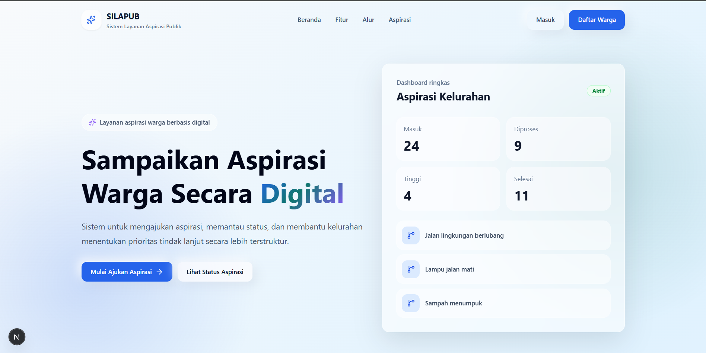

### Login

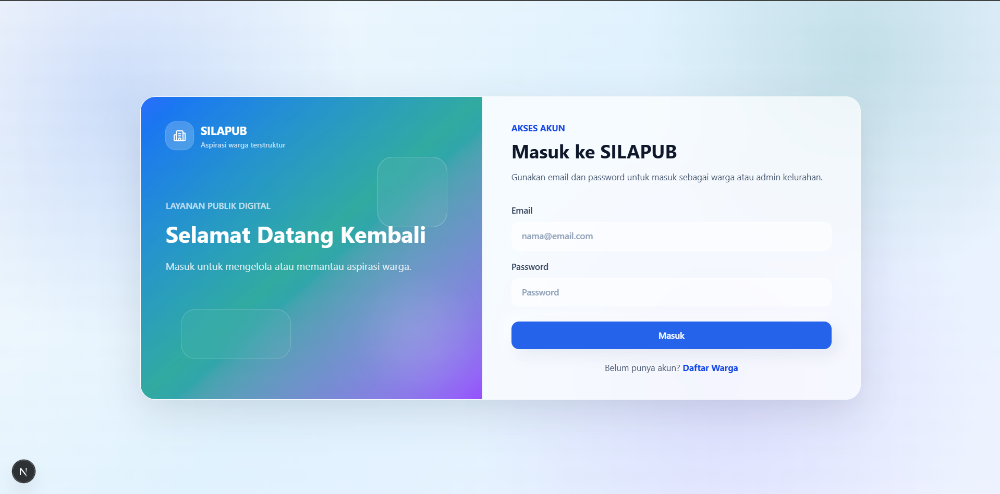

### Register Warga

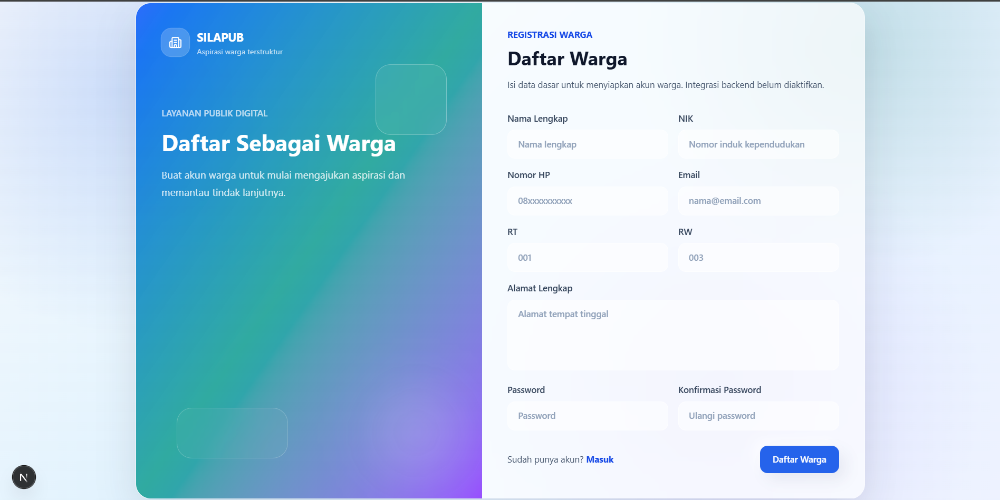

### Dashboard Warga

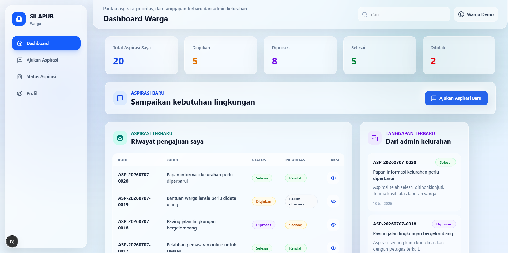

### Form Pengajuan Aspirasi

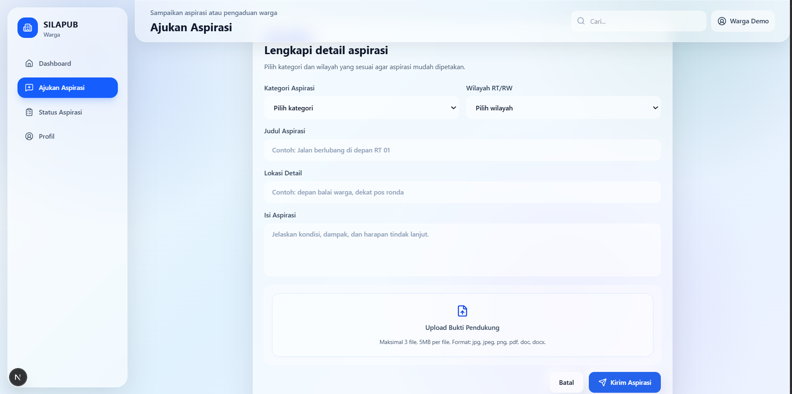

### Detail Aspirasi Warga

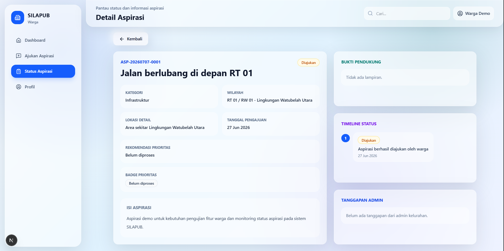

### Dashboard Admin

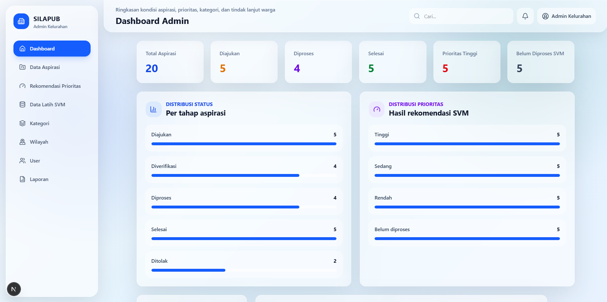

### Data Aspirasi Admin

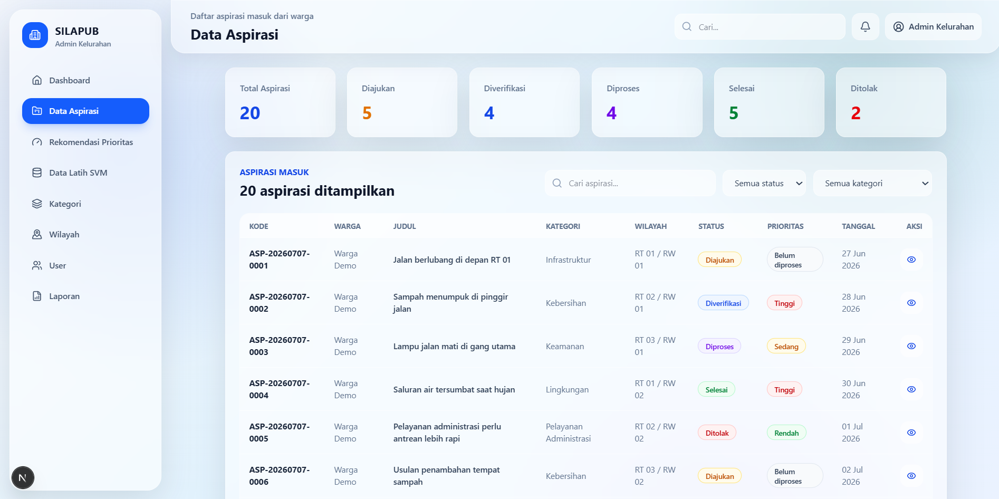

### Detail dan Verifikasi Aspirasi

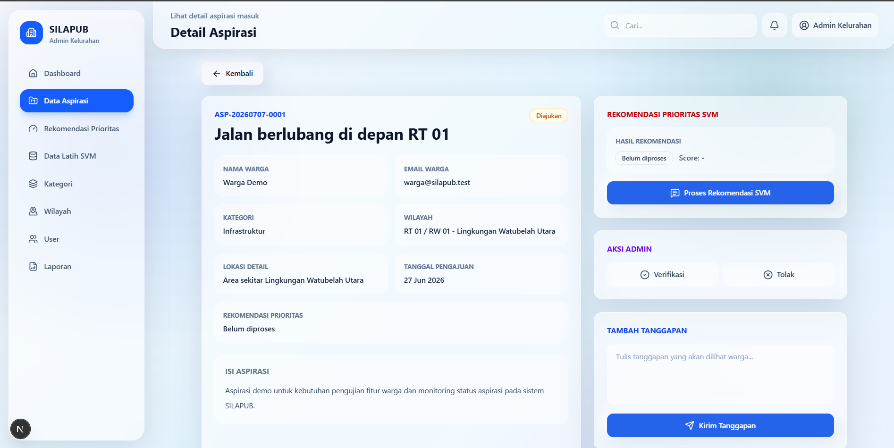

### Rekomendasi Prioritas SVM

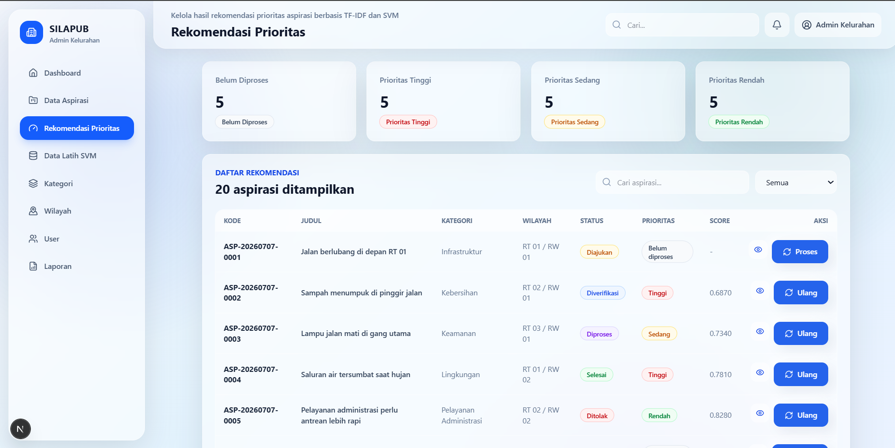

### Data Latih SVM

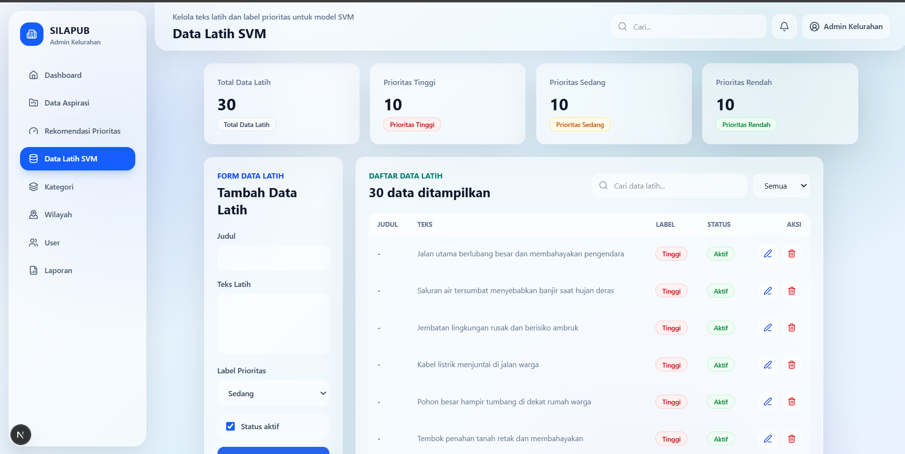

### Laporan Aspirasi

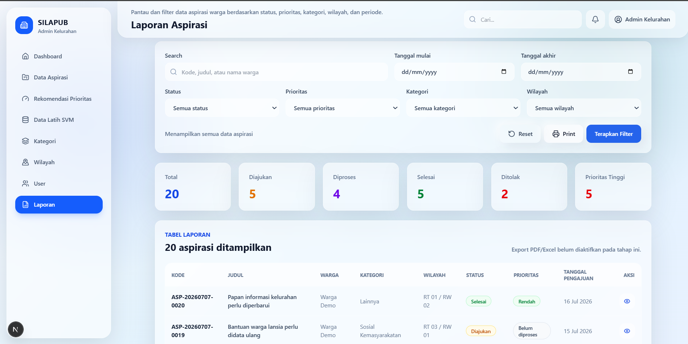

### Print Preview Laporan

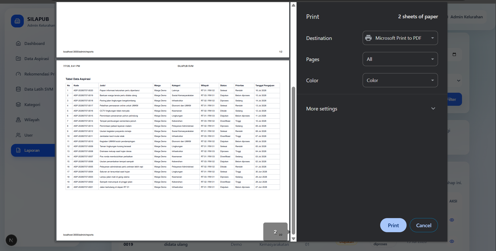

## Setup Backend

Pastikan PHP, Composer, PostgreSQL, dan ekstensi database PostgreSQL untuk PHP sudah tersedia.

```powershell
cd backend
composer install
copy .env.example .env
php artisan key:generate
php artisan migrate:fresh --seed
php artisan storage:link
php artisan serve --host=127.0.0.1 --port=8000
```

Contoh konfigurasi `.env` backend:

```env
APP_URL=http://127.0.0.1:8000

DB_CONNECTION=pgsql
DB_HOST=127.0.0.1
DB_PORT=5432
DB_DATABASE=silapub_svm
DB_USERNAME=postgres
DB_PASSWORD=your_password

FRONTEND_URL=http://localhost:3000
ML_SERVICE_URL=http://127.0.0.1:5001
```

Gunakan nilai environment sesuai mesin lokal masing-masing. Jangan commit `.env` asli atau password database pribadi.

## Setup Frontend

Pastikan Node.js dan npm sudah tersedia.

```powershell
cd frontend
npm install
npm run dev
```

Buat file `.env.local` pada folder `frontend` dengan isi berikut:

```env
NEXT_PUBLIC_API_URL=http://127.0.0.1:8000/api
NEXT_PUBLIC_APP_NAME=SILAPUB
```

Frontend berjalan di `http://localhost:3000`.

## Setup ML Service

Pastikan Python sudah tersedia.

```powershell
cd ml-service
python -m venv .venv
.\.venv\Scripts\activate
pip install flask flask-cors scikit-learn pandas numpy joblib
python app.py
```

ML service berjalan di `http://127.0.0.1:5001`.

Endpoint utama ML service:

- `GET /health` untuk mengecek status service
- `POST /predict` untuk memprediksi prioritas aspirasi

## Environment Variable

Environment variable utama yang digunakan:

| Service | Variable | Keterangan |
| --- | --- | --- |
| Backend | `APP_URL` | URL aplikasi Laravel API |
| Backend | `DB_CONNECTION` | Driver database, gunakan `pgsql` |
| Backend | `DB_HOST` | Host PostgreSQL |
| Backend | `DB_PORT` | Port PostgreSQL |
| Backend | `DB_DATABASE` | Nama database aplikasi |
| Backend | `DB_USERNAME` | Username database lokal |
| Backend | `DB_PASSWORD` | Password database lokal |
| Backend | `FRONTEND_URL` | URL frontend Next.js |
| Backend | `ML_SERVICE_URL` | URL Flask ML service |
| Frontend | `NEXT_PUBLIC_API_URL` | Base URL Laravel API |
| Frontend | `NEXT_PUBLIC_APP_NAME` | Nama aplikasi di frontend |

## Akun Demo

| Role | Email | Password |
| --- | --- | --- |
| Admin | `admin@silapub.test` | `password` |
| Warga | `warga@silapub.test` | `password` |

Akun demo dibuat melalui seeder dan hanya digunakan untuk kebutuhan pengujian lokal atau portfolio.

## Alur Penggunaan Sistem

1. Warga membuka landing page dan melakukan registrasi atau login.
2. Warga mengajukan aspirasi melalui form pengajuan dan dapat menambahkan lampiran.
3. Sistem menyimpan aspirasi dan menampilkan status awal kepada warga.
4. Admin login ke dashboard admin untuk melihat daftar aspirasi masuk.
5. Admin membuka detail aspirasi, melakukan verifikasi, memberi tanggapan, dan memperbarui status.
6. Sistem dapat meminta rekomendasi prioritas ke ML service berdasarkan teks aspirasi dan data latih SVM.
7. Admin mengelola data latih, kategori, wilayah, dan laporan aspirasi.
8. Warga memantau perkembangan aspirasi melalui halaman detail aspirasi.

## Validasi Build

Perintah yang dapat digunakan untuk validasi lokal:

```powershell
cd backend
php artisan test
```

```powershell
cd frontend
npm run lint
npm run build
```

```powershell
cd ml-service
.\.venv\Scripts\activate
python app.py
```

Pastikan backend, frontend, dan ML service berjalan bersamaan agar fitur rekomendasi prioritas dapat digunakan.

## Catatan Pengembangan Lanjutan

- Menambahkan proses training model yang tersimpan secara permanen.
- Menambahkan dashboard statistik aspirasi yang lebih detail.
- Menambahkan filter laporan berdasarkan wilayah, kategori, status, dan rentang tanggal.
- Menambahkan export laporan ke PDF atau Excel.
- Menambahkan notifikasi real-time untuk perubahan status aspirasi.
- Menambahkan pengujian otomatis untuk alur warga dan admin.

## Lisensi / Catatan Portfolio

Project ini dibuat sebagai project portfolio dan bahan demonstrasi sistem informasi layanan aspirasi publik dengan integrasi Machine Learning.

Data, akun demo, dan konfigurasi yang ditampilkan pada README ini bersifat contoh. Jangan menggunakan atau membagikan data sensitif pada repository publik.
